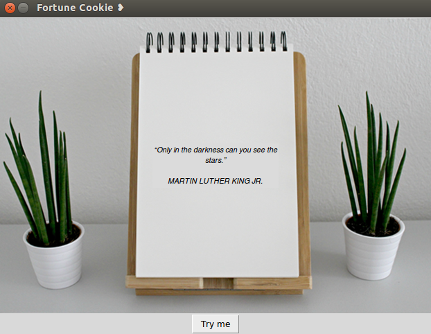

# :dizzy: Fortune Cookie

## :clipboard: Description 
Simple web scraping app for getting your quote of the day, developed using Python, Requests and BeautifulSoup libraries, and Tkinter, standard GUI package for Python.

## :computer: Usage
Follow these instructions to try this app on your local machine. 

### Prerequisites
You will need to install requests, BeautifulSoup and Tkinter, you can see how to do that [here](https://docs.python.org/3/installing/).

### Example of usage
1. Download the repository
2. Run the following command from terminal

*if you have python2*

```
$ python fortune_cookie.py
```

*or this one if you have python3*

```
$ python3 fortune_cookie.py
```
## :joystick: Demo


## :wrench: Technologies used
* [Python](https://www.python.org/)
* [Requests](http://docs.python-requests.org/en/master/) *HTTP library*
* [BeautifulSoup](https://www.crummy.com/software/BeautifulSoup/bs4/doc/) *for pulling data out of HTML*
* [Tkinter](https://wiki.python.org/moin/TkInter) *for GUI*


